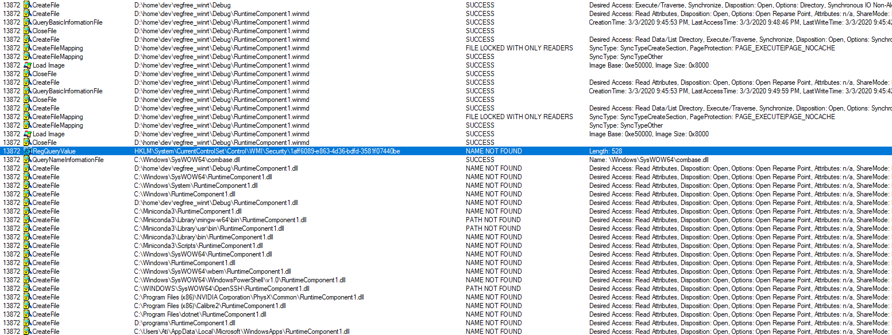

# regfree_winrt_fail

A barebones example of reg free WinRT that should work but it doesn't.

The WinRT component is written in C#, and produces a .winmd file referenced by
the C++ console application.

The C++/WinRT console application references the .winmd file in its .manifest,
and uses the VCRTForwarders Nuget package.

When running the application I get a winrt::hresult_class_not_available
exception when trying to instantiate Class1 exported by the .winmd file.

The solution was set up largely according to this post
https://blogs.windows.com/windowsdeveloper/2019/04/30/enhancing-non-packaged-desktop-apps-using-windows-runtime-components/

According to procmon [1] the runtime is at least looking in the right .winmd file,
but it appears it really doesn't find the class in there, even though
cppwinrt.exe does.

[1]:

